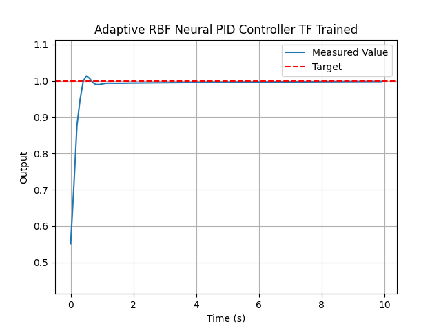

# RBF-aPID-Controller
RBF Neural Net Adaptive PID Controller

Implementations of a radial basis function (RBF) neural network adaptive PID controller. Uses 
neural net and error information from PID control to adapt the control signal. Provides one 
adaptation value, using error, integral, and derivative. 

To adapt the PID gains themselves, network outputs must be made to 3 neurons. Example usage 
with simulated data can be found in `first_order_sim.py`

The method has been implemented in three ways: 

1. [TF_Implementation](/TF_Implementation/): Using TensorFlow to build and train the RBF Model.

2. [NP_Implementation](/NP_Implementation/): Using Numpy to build and train the RBF Model.

3. C++ `CPP_Implementation`: Written in C++ (requiring `cmath`), for use on embedded systems.
