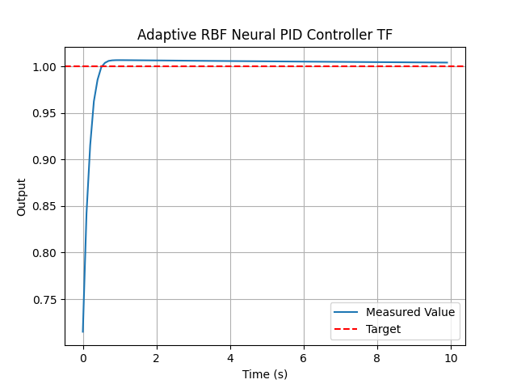
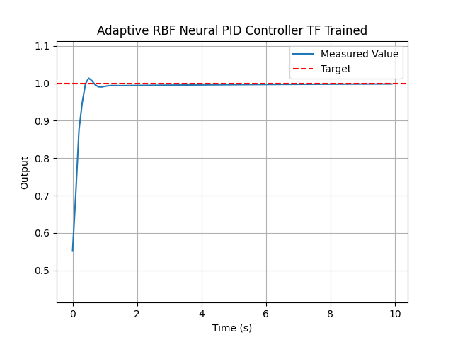
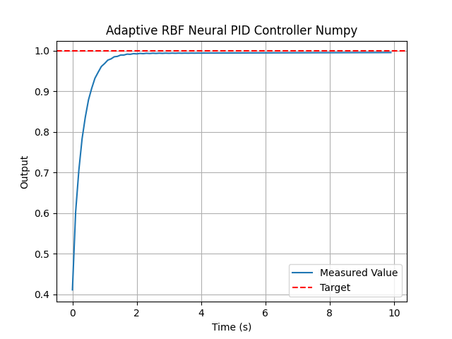
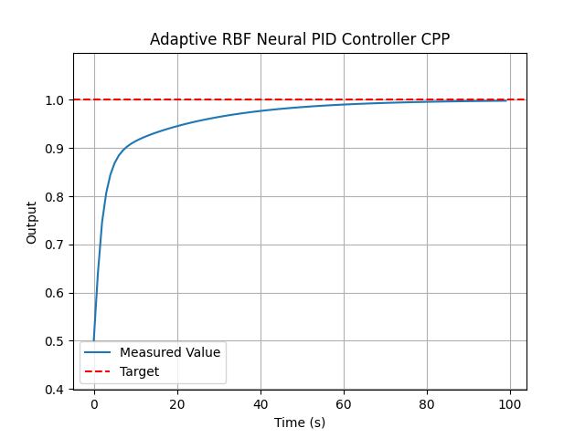
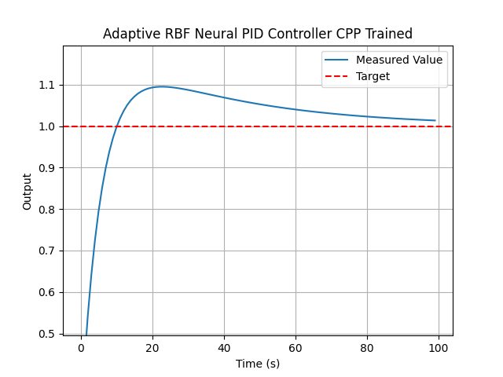

# RBF-aPID-Controller
RBF Neural Net Adaptive PID Controller

Implementations of a radial basis function (RBF) neural network adaptive PID controller. Uses 
neural net and error information from PID control to adapt the control signal. 

### Python Implementation
Developed to provide one adaptation value to the control signal 
using the error, integral, and derivative terms. Done in `TensorFlow` and `Numpy`.
To adapt the PID gains instead of the control signal in TF, the network outputs 
must be made to 3 neurons and added to the gains. In Numpy, the gains will need to
be added to inputs and the adapted signal added to the gains. 

Example usage with simulated data can be found in [first_order_sim.py](first_order_sim.py). Tests
to be added. 

### C++ Implementation
A hybrid method; uses the error and PID gains (Kp, Ki, and Kd) to adapt the control signal. 
This gives more flexibility to the control model as the gains can be easily adapted since 
the RBF model already learns from them. The dual inputs should provide greater stability to
the system, but will be more sensitive to the gains.

The C++ implementation can already be used for any adaptation, adding the result of `predict()` to
whatever values are desired to adapt. Uses just the `cmath` and `cstdlib` libraries with memory 
management handled manually as the system it was designed for could not import additional libraries. 
`cstdlib` can be removed if you don't care about random initialization of the centers. 

Example usage with simulated data can be found in [main.cpp](/CPP_Implementation/main.cpp). 
It includes some additional libraries in order to show an example usage with a simple first 
order simulation.

The project doesn't currently implement a CMake build as it was pulled from a greater build implementation.\
An example manual compilation:
```
g++ -std=c++20 -o rbf_model_test rbf_model.cpp rbf_model_test.cpp -lgtest -lgtest_main -pthread -g -Wall
g++ -std=c++20 -o apid_controller_test apid_controller.cpp apid_controller_test.cpp -lgtest -lgtest_main -pthread -g -Wall

./apid_controller_test
./rbf_model_test

g++ -std=c++20 -o control_system main.cpp apid_controller.cpp rbf_model.cpp -lgtest -lgtest_main -pthread -g -Wall
./control_system
```

Simulation examples from the three implementations: 

1. [TF_Implementation](/TF_Implementation/): Using TensorFlow to build and train the RBF Model.




2. [NP_Implementation](/NP_Implementation/): Using Numpy to build and train the RBF Model.



3. [CPP_Implementation](/CPP_Implementation/): Using C++ for embedded systems to build and train the RBF Model. 



